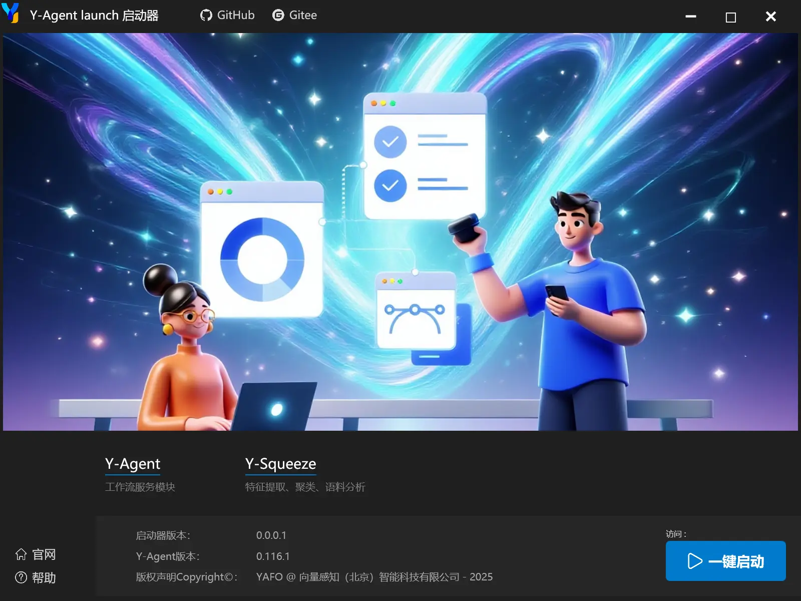

# Y-Agent-launch启动器使用说明

启动器内部集成了Y-Agent和Y-Squeeze

1. 直接下载绿色版安装包。

2. 解压后，运行`Y-Agent-launch.exe`即可。

3. 首次启动项目，会自动创建Python嵌入式虚拟环境，并自动下载依赖，请耐心等待。

> 使用Y-Agent-launch启动器，快捷方便，无需复杂配置，同时不会影响本机Python环境。

## Y-Agent 简介
Y-Agent Studio 是一个面向 企业级应用 的Agent开发套，Y-Agent是其中的核心模块。

包含了：支持智能体编排、RAG、流程日志、单元测试、流程测试、语料生产等垂直领域非常需要的功能。

智能体编排可以在同一个流程中，同时支持多智能体协作和流程混合编排。语料生产部分功能需要Y-Squeeze支持。

## Y-Squeeze 简介

一个利用注意力机制，提供特征提取、聚类、语料分析等功能，平时可用于做内部研究分析。

另外为框架提供了两大核心功能：
1. 识别模型不懂的知识。
2. 对语料进行质量评估。

## 相关资料：

[Y-Agent Studio官方介绍](http://112.126.109.80/docs)

[Y-Agent 使用说明](http://112.126.109.80/docs/y-agent/quick_start)

[Y-Squeeze 使用说明](http://112.126.109.80/docs/y-squeeze/introduction)

[Y-Trainer 介绍](http://112.126.109.80/docs/y-trainer/introduction)

[Y-Agent Studio官网](http://112.126.109.80)

